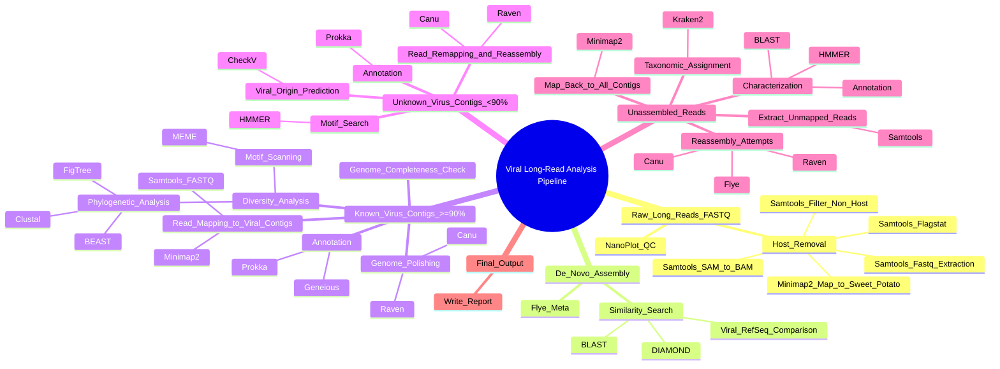

```mermaid
mindmap
  root((Viral Long-Read Analysis Pipeline))

    Raw_Long_Reads_FASTQ
      NanoPlot_QC
      Host_Removal
        Minimap2_Map_to_Sweet_Potato
        Samtools_SAM_to_BAM
        Samtools_Flagstat
        Samtools_Filter_Non_Host
        Samtools_Fastq_Extraction

    De_Novo_Assembly
      Flye_Meta
      Similarity_Search
        DIAMOND
        BLAST
        Viral_RefSeq_Comparison

    Known_Virus_Contigs_>=90%
      Genome_Completeness_Check
      Read_Mapping_to_Viral_Contigs
        Minimap2
        Samtools_FASTQ
      Genome_Polishing
        Canu
        Raven
      Annotation
        Prokka
        Geneious
      Diversity_Analysis
        Motif_Scanning
          MEME
        Phylogenetic_Analysis
          Clustal
          BEAST
          FigTree

    Unknown_Virus_Contigs_<90%
      Viral_Origin_Prediction
        CheckV
      Motif_Search
        HMMER
      Read_Remapping_and_Reassembly
        Canu
        Raven
      Annotation
        Prokka

    Unassembled_Reads
      Map_Back_to_All_Contigs
        Minimap2
      Extract_Unmapped_Reads
        Samtools
      Taxonomic_Assignment
        Kraken2
      Reassembly_Attempts
        Flye
        Canu
        Raven
      Characterization
        BLAST
        HMMER
        Annotation

    Final_Output
      Write_Report
```