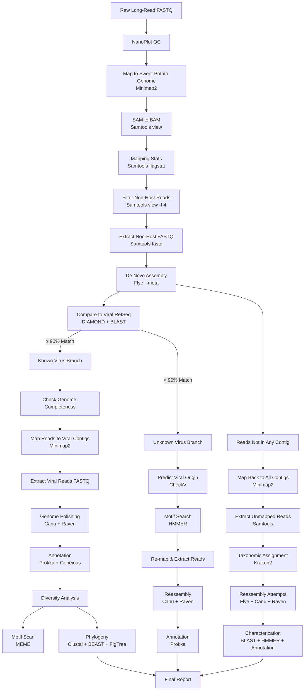

```mermaid
flowchart TD

A[Raw Long-Read FASTQ] --> B[NanoPlot QC]

B --> C[Map to Sweet Potato Genome<br>Minimap2]
C --> D[SAM to BAM<br>Samtools view]
D --> E[Mapping Stats<br>Samtools flagstat]
E --> F[Filter Non-Host Reads<br>Samtools view -f 4]
F --> G[Extract Non-Host FASTQ<br>Samtools fastq]

G --> H[De Novo Assembly<br>Flye --meta]
H --> I[Compare to Viral RefSeq<br>DIAMOND + BLAST]

I -->|≥ 90% Match| J[Known Virus Branch]
I -->|< 90% Match| K[Unknown Virus Branch]

J --> J1[Check Genome Completeness]
J1 --> J2[Map Reads to Viral Contigs<br>Minimap2]
J2 --> J3[Extract Viral Reads FASTQ]
J3 --> J4[Genome Polishing<br>Canu + Raven]
J4 --> J5[Annotation<br>Prokka + Geneious]
J5 --> J6[Diversity Analysis]
J6 --> J7[Motif Scan<br>MEME]
J6 --> J8[Phylogeny<br>Clustal + BEAST + FigTree]

K --> K1[Predict Viral Origin<br>CheckV]
K1 --> K2[Motif Search<br>HMMER]
K2 --> K3[Re-map & Extract Reads]
K3 --> K4[Reassembly<br>Canu + Raven]
K4 --> K5[Annotation<br>Prokka]

H --> L[Reads Not in Any Contig]
L --> L1[Map Back to All Contigs<br>Minimap2]
L1 --> L2[Extract Unmapped Reads<br>Samtools]
L2 --> L3[Taxonomic Assignment<br>Kraken2]
L3 --> L4[Reassembly Attempts<br>Flye + Canu + Raven]
L4 --> L5[Characterization<br>BLAST + HMMER + Annotation]

J8 --> M[Final Report]
K5 --> M
L5 --> M
```
